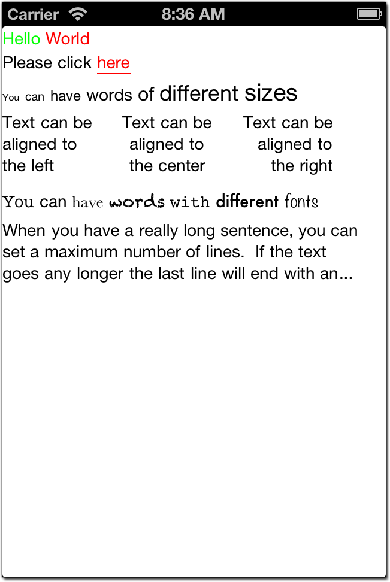

UIFormattedLabel
==============================

A control for displaying a string of text where various words and phrases can have different 
formatting options and behavior from surrounding text.  The following attributes apply to 
each individual word and can thus be adjusted independently:

* Text color
* Font (and thus font size, bold, italics, etc.)
* Text decoration (underline, strikethrough)
* Tap events (underline a word and respond to when the user taps on it)
* Text alignment (standard "paragraph" alignment options of left, right, and center)
* Maximum lines (when surpassed, an ellipsis will be rendered at the end of the max line)

Any of these settings can be updated after the fact, followed by a call to `Refresh()`.

Usage Sample:

	var paragraph = new[]
	{
		new Phrase("
	};
    var label = new UIFormattedLabel(paragraph);
